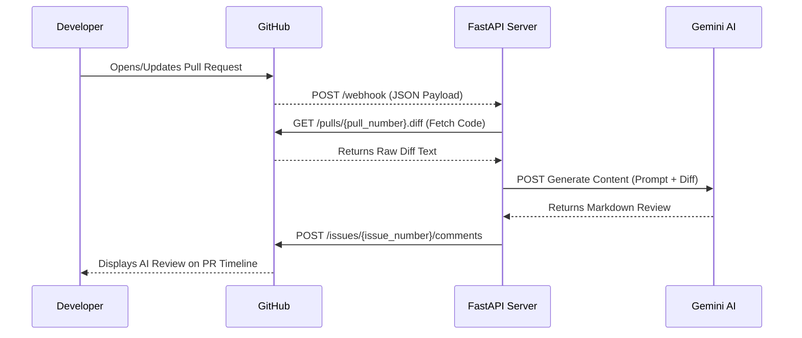

<div align="center">

# 🚀 AI-Powered CI/CD Pull Request Reviewer

**Autonomous Code Analysis & Security Vulnerability Detection Pipeline**

[](#)
[](https://fastapi.tiangolo.com/)
[](https://www.docker.com/)
[](https://ai.google.dev/)
[](#)
[](#)

*An intelligent webhook integration that acts as a senior engineer, analyzing code diffs in real-time to catch bugs, flag security risks, and enforce best practices before code is merged.*

</div>

---

## 📖 Table of Contents
- [Overview](#-overview)
- [Key Features](#-key-features)
- [System Architecture](#-system-architecture)
- [Tech Stack](#-tech-stack)
- [Local Development Setup](#-local-development-setup)
- [Environment Variables](#-environment-variables)
- [Deployment Strategy](#-deployment-strategy)
- [Roadmap](#-roadmap)

---

## 🔭 Overview

In modern software development, manual code reviews can become a severe bottleneck. The **AI PR Reviewer** automates the initial layer of code inspection. By intercepting GitHub Pull Request webhooks, this service fetches the raw file diffs, processes them through the Google Gemini Large Language Model, and publishes a highly detailed, actionable Markdown review directly to the GitHub PR timeline.

This tool reduces human reviewer fatigue, catches critical security flaws (like hardcoded credentials) early, and accelerates the CI/CD pipeline.

---

## ✨ Key Features

* **Real-Time Webhook Interception:** Asynchronously processes GitHub `pull_request` events (`opened`, `synchronize`).
* **Deep Context Analysis:** Leverages Gemini 2.5 Flash to understand code context, logic flow, and edge cases.
* **Security First:** Explicitly prompted to flag hardcoded secrets, injection vulnerabilities, and improper error handling.
* **Actionable Feedback:** Outputs neatly formatted Markdown with specific code block recommendations, avoiding nitpicky formatting comments.
* **Stateless & Containerized:** Fully dockerized for zero-downtime deployment and infinite scalability.

---

## 🏗 System Architecture

The pipeline operates on an asynchronous event-driven architecture. 



---

## 💻 Tech Stack

| Component | Technology | Purpose |
| --- | --- | --- |
| **Backend Framework** | `FastAPI` | High-performance, asynchronous REST API. |
| **AI Engine** | `Google Gemini API` | Advanced reasoning and code diff analysis. |
| **Integration** | `GitHub REST API` | Fetching raw diffs and posting timeline comments. |
| **Infrastructure** | `Docker` | Containerization for consistent environments. |
| **Hosting** | `Hugging Face Spaces` | Cloud hosting for continuous webhook listening. |

---

## 🛠 Local Development Setup

To run this pipeline locally and test it against your own repositories:

**1. Clone the repository**

```bash
git clone [https://github.com/anberaziz5/ai-pr-reviewer.git](https://github.com/anberaziz5/ai-pr-reviewer.git)
cd ai-pr-reviewer

```

**2. Create a virtual environment**

```bash
python -m venv venv
source venv/bin/activate  # On Windows use `venv\Scripts\activate`

```

**3. Install dependencies**

```bash
pip install -r requirements.txt

```

**4. Start the server**

```bash
uvicorn main:app --reload --port 8000

```

*Note: To receive webhooks locally, you will need to expose your local port 8000 to the internet using a tool like [Ngrok](https://ngrok.com/) or GitHub Codespaces Port Forwarding.*

---

## 🔐 Environment Variables

Create a `.env` file in the root directory. The application requires the following secrets to function:

| Variable | Description | Where to get it |
| --- | --- | --- |
| `GEMINI_API_KEY` | Authenticates requests to the LLM. | [Google AI Studio](https://aistudio.google.com/) |
| `GITHUB_TOKEN` | Personal Access Token (PAT) with `repo` scope to read diffs and write comments. | [GitHub Developer Settings](https://github.com/settings/tokens) |

> **Warning:** Never commit your `.env` file to version control. It is explicitly ignored in the `.gitignore`.

---

## 🚀 Deployment Strategy

This application is containerized using Docker and optimized for deployment on **Hugging Face Spaces** (or any standard container orchestration platform like Kubernetes, AWS ECS, or Render).

**Dockerfile Highlights:**

* Base Image: `python:3.10`
* Exposed Port: `7860` (Hugging Face standard)
* Execution: `uvicorn` bounded to `0.0.0.0`

To deploy:

1. Create a new Docker Space on Hugging Face.
2. Upload the repository contents.
3. Add `GEMINI_API_KEY` and `GITHUB_TOKEN` to the Space Secrets.
4. Point your GitHub Webhook to the provided Hugging Face direct URL appended with `/webhook`.

---

## 🛣 Roadmap

* [x] Basic PR diff fetching and AI review generation.
* [x] Containerize application via Docker.
* [ ] Add support for filtering out specific file types (e.g., `.lock` files, `package-lock.json`).
* [ ] Implement multi-file chunking for massive Pull Requests that exceed standard context windows.
* [ ] Add slash-command support (e.g., developer comments `/ai-re-review` to trigger a fresh analysis).

---